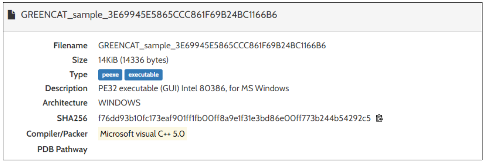

> **3줄 요약**
> 1. 실행 시 `winlogdate.exe` 파일 드롭
> 2. 레지스트리 수정으로 로그인 마다 실행
> 3. 통신 및 원격 접속으로 개인정보 탈취

//

## 분석 파일
- 파일: [5340.ex_](https://drive.google.com/file/d/1MvkYU6puuHX-1FaObSrZsGgaYOwynfEZ/view?usp=sharing)
- 비밀번호: malware 
- ***주의: 격리된 환경에서만 실행***

//

***발퀄 및 건너짚기가 남발하는 문서임니당***   

자동화 분석 시스템이 잘 되어있다길래 한번 써보자!

## 1. 정적 분석

- 형식:  윈도우 32bit PE 포맷 실행파일

작성성중주우주우주웅우우ㅜ